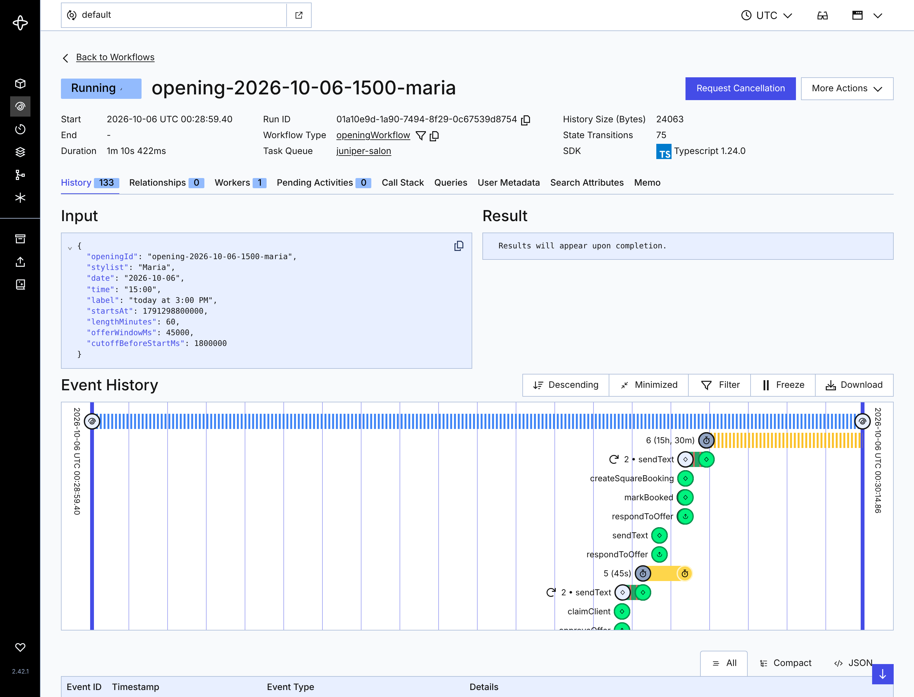

# Evidence

`temporal-ui-workflow.png` shows one representative opening Workflow in the Temporal Web UI:

- **Workflow ID:** `opening-2026-10-06-1500-maria` (Maria, 3:00 PM, 1 hour)
- **Status:** Running. A booked opening stays open until the appointment ends so staff can reopen it or mark a no-show.
- **Event history:** the full demo path. Priya's offer timed out (the 45-second practice-mode timer), Tom's text failed (bad number, marked unreachable), Aiko's text was retried once after a simulated carrier error (`2 • sendText`), Priya's late reply was turned away, and Aiko accepted (`respondToOffer` Update → `markBooked` → `createSquareBooking` → confirmation text). The long timer at the top is the wait until the appointment ends.

All client names and phone numbers are fictional sample data.
